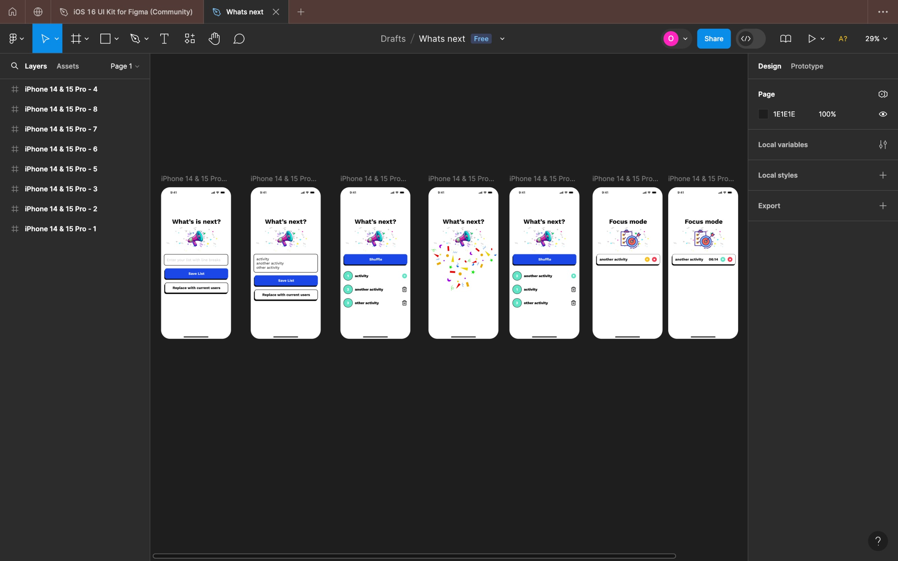

# Welcome to What's Next app 👋

This project is my first attempt to creating a react native app.



I challenged my self to learn react native in two weeks and so I drafted a simple app UI called What's Next.

This app takes a list of activities or participants that will take place randomly and records the time each item on the list takes and can shuffle the list to randomly select what's next.

## Get started

1. Install dependencies

   ```bash
   npm install
   ```

2. Start the app

   ```bash
    npx expo start
   ```
